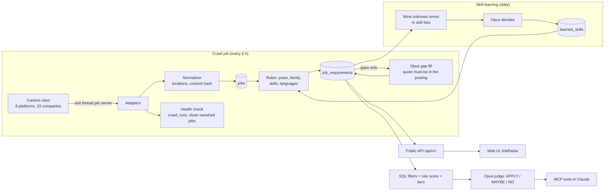

# job-agent

A job-search agent for the Indian tech market. It crawls live openings straight from the careers sites of 33 large
companies (Amazon, JPMorgan, Qualcomm, NVIDIA, Visa, Adobe, ...), works out what each job really asks for, and helps a
candidate find the ones worth applying to, either with an AI assistant (Claude, over MCP) or with a fast web UI that
needs no AI at all. The human always clicks "apply".

**5,332 open India jobs · 33 companies · 8 careers platforms · refreshed every 6 hours** (numbers from 2026-10-06)

## What it does

| Part | What it does |
|---|---|
| **Crawling** | Adapters for 8 platforms (Workday, Eightfold, Oracle Recruiting Cloud, Greenhouse, Lever, SmartRecruiters, Ashby, Amazon) read the same JSON the companies' own careers pages use. One virtual thread per server, polite pacing that slows down on throttling, health checks per crawl, closing of jobs that disappear. |
| **Understanding jobs** | Rules extract each job's experience range, job family (software, data and ML, hardware, product, ...), skills and main languages. Where the rules find nothing, Claude Opus fills the gap, and its answer is only accepted if the quote it gives really appears in the posting. |
| **AI search (MCP)** | In Claude (Code or Desktop) a candidate shares a resume; the server shortlists jobs with SQL filters and rules, then Opus reads each posting and says APPLY / MAYBE / NO with a reason. A background worker keeps more APPLY jobs ready; verdicts are cached, so a repeat search is instant. |
| **Web UI (JobRadar)** | A search page over the same data with no AI: pick companies, job families, experience range, cities, skills, posting date; live counts on every filter; job details in a side drawer. |
| **Self-learning skills** | Finds tech terms the skill dictionary does not know yet (by the company they keep in skill lists), lets Opus decide what they are, checks the answers and adds them. |

## How it works



**1. Crawl job.** Every company's crawl runs on a virtual thread per *server*: companies sharing a server (all Lever
boards, one Workday cluster) go one after another, so we never send parallel requests to one server; different servers
run at the same time. For each company: fetch the list, fetch each job's details (or reuse the stored ones, below), save,
extract requirements with the rules, check the crawl's health, close jobs missing from two good crawls in a row, and
let Opus fill the gaps of that company's new jobs right away (so a slow company never holds the others back). A long crawl
saves its jobs in batches, and when the app is stopped on purpose (a deploy) it saves its batch and records the run as
partial first. A company that throttles (Qualcomm, Microsoft) is crawled at
most once a day.

**2. Understanding a job.** Rules first, because they are fast, free and testable: a years-of-experience parser that
knows required vs preferred sections, typed bullets and level ladders; a job-family classifier that votes with the
title, the department and the description; a skill dictionary with aliases and ambiguous words ("Go", "Excel" only
count next to other skills). Opus only answers what the rules left empty, and every answer is checked (the evidence
must be quoted from the posting, values must be in range, the family must be one of ours).

**3. AI search.** SQL filters are the only step that may drop a job (country, location, family, experience window).
Every remaining job gets a rule score; likely-NO jobs (a senior title without stated years, embedded work without C)
move to a second tier. Opus then judges in that order: the first 10 in parallel for the first answer, the rest in the
background until 15 APPLY jobs are ready or 20 NOs come in a row. Verdicts are stored per (profile, job version,
rubric), and a saved profile ID makes a repeat search reuse all of them.

**4. Self-learning skills.** Postings list skills together ("Splunk, Datadog, New Relic, Dynatrace"); when a list
already holds two known skills, its unknown items are candidates. Terms seen at 3+ companies go to Opus once
(new skill / other name of a known skill / not a skill); answers are checked (each spelling must appear in the
postings and must not belong to another skill) and go live on top of the hand-made dictionary.

## Measured results

All numbers are measured on the real data; how each was measured is in `eval/` and in the git history.

**Crawling and operations**

| What | Result |
|---|---|
| Coverage | 5,332 open India jobs from 33 companies on 8 platforms (Amazon 2,312; 15 Workday companies 1,101; 4 Oracle tenants 620; Qualcomm 593; Lever, Greenhouse, SmartRecruiters, Ashby 706) |
| Full crawl of all companies | 155 s, down from about 10 minutes: job details are only downloaded for new or changed jobs; one run fetched 16 details and reused 2,472 (99.4% of detail requests saved) |
| Health checks | 99 crawls recorded; the one failure (a malformed Workday entry at Mastercard) was caught and nothing was closed by mistake; 99 vanished jobs closed so far |
| Politeness | adaptive pacing (1 s per request, slower on every 429, gives up after 5 in a row); throttling sites crawled once a day; no bot-protection bypassing, blocked sites are skipped |

**Understanding jobs**

| What | Result |
|---|---|
| Experience range found | 83% of jobs (4,430 of 5,332) with a stated range; the rest mostly state none |
| Job family | all but 5 jobs classified; 597 families set or confirmed by Opus where the rules only guessed |
| Opus gap fill | 1,013 jobs, $26.23 in total (about $0.026 per job), every answer checked against the posting |
| Small local models instead of Opus (Ollama, years of experience on 124 jobs) | the rules were right on about 119, qwen3:4b on about 108, qwen2.5:3b far fewer: not adopted |

**Search quality**

| What | Result |
|---|---|
| Answer key | Opus judged all 287 tech jobs for the author's profile with a fixed rubric; the author reviewed every APPLY/MAYBE and every disagreement with their own blind labels and confirmed Opus each time |
| Rule ranking against it | nDCG@10 0.89; all 7 APPLY jobs in the top 25 |
| Cheaper judge | Claude Haiku agreed with Opus far less (Cohen's kappa 0.46; 0.85 with thinking, but much slower); Opus kept |
| Speed | first answer 15 to 30 s (10 judged in parallel); a repeat search with a saved profile ID 0.16 s and 0 Opus calls |
| Embeddings (tested, not adopted) | two local models (MiniLM, bge-small) on three fully labeled test sets: today's rules + tiers needed 42 Opus checks to find 10 APPLY jobs per set in total, the best rules + embedding mix also 42, embeddings alone 46 to 49. Same quality, more moving parts, so not added. Report: `eval/embeddings/REPORT.md` |

**Self-learning skills**

| What | Result |
|---|---|
| Learned | 195 new skills (Dynatrace, AWS Lambda, SAML, Infrastructure as Code, CrewAI, LDAP, ...) for $2.07 of Opus |
| Effect | jobs where no skill was recognized: 1,375 → 964; skills found per job: 4.19 → 5.80 |

**Web UI**: search 5 to 12 ms, live filter counts about 25 ms over 5,332 jobs.

## Tech stack

Java 21 (run on JDK 25) · Spring Boot 4.1 · Spring AI 2.0 (MCP server, structured output) · PostgreSQL 18 with Flyway
(22 migrations) and plain JdbcClient · Jsoup · Claude Opus through a custom Spring AI `ChatModel` over the Claude Code
CLI · React 19 + TypeScript + Vite + Tailwind 4 + Framer Motion + TanStack Query for the UI · 271 unit tests.

## Running it

**Requirements**: JDK 21+, Docker, Node 20+ (for the UI), and for the AI parts the Claude Code CLI logged in.

```bash
# 1. Database (PostgreSQL 18 on port 5433, password "ragpass", database "jobagent")
docker run -d --name rag-postgres -e POSTGRES_PASSWORD=ragpass -p 5433:5432 postgres:18
docker exec rag-postgres psql -U postgres -c "CREATE DATABASE jobagent"

# 2. The app (Flyway creates the schema and the company list on start)
export CLAUDE_CODE_OAUTH_TOKEN=...                       # from `claude setup-token`, only for the AI parts
export JOBAGENT_LLM_CLAUDECLI_COMMAND=$(which claude)
./mvnw spring-boot:run

# 3. First data: crawl everything (takes a few minutes), then open the UI
curl -X POST localhost:8080/admin/crawl
npm --prefix web install && npm --prefix web run dev     # http://localhost:5173

# 4. AI search in Claude Code
claude mcp add --transport http --scope user job-agent http://localhost:8080/mcp
```

Both background jobs are **off by default**; switch them on in `src/main/resources/application.yaml`:

| Setting | Job |
|---|---|
| `jobagent.crawl.schedule.enabled` | crawl job every 6 hours (`cron`), then the Opus gap fill |
| `jobagent.skills.learning.enabled` | skill learning daily at 03:30, at most 300 terms to Opus per run |

Every other setting (app-wide in `application.yaml`, per company in the `companies` table) is listed in
[CONFIGURATION.md](CONFIGURATION.md).

**Endpoints** (`/admin/**` and `/mcp` need the API key when `JOBAGENT_SECURITY_API_KEY` is set: header `X-API-Key: <key>`; the web API `/api/v1` is open but rate limited; `JOBAGENT_WEB_DIR` serves the built UI)

| Endpoint | What it does |
|---|---|
| `POST /admin/crawl` | the whole crawl job by hand (every company, then the gap fill), the same as the scheduler |
| `POST /admin/crawl/{company}` | crawl one company (no gap fill) |
| `GET /admin/crawl/{company}/preview` | fetch live and show what would be saved, without saving |
| `GET /admin/health` | every company's last crawl, its status and alerts |
| `POST /admin/skills/learn` | the whole skill-learning run by hand |
| `POST /admin/requirements/rebuild?all=true` | re-run the rules over every job (after a rule change) |
| `GET /api/v1/meta`, `/jobs`, `/facets`, `/jobs/{id}` | the read-only API behind the web UI |
| `/mcp` | MCP server: `match_jobs`, `more_jobs`, `export_jobs`, `get_job`, `get_profile`, `list_companies`, prompt `find-jobs` |

## Deploying

Pushing to `main` deploys by itself (`.github/workflows/deploy.yml`): GitHub's machine runs the unit tests and builds
the jar and the web UI; if all tests pass, a self-hosted runner on the home server takes the build, swaps in the new
jar and UI, restarts the service and checks the health endpoint (`deploy/deploy.sh`). If the new version does not
become healthy, the previous jar is put back. Pull requests never reach the server.

## Project layout

```
src/main/java/.../jobagent/
  crawl/          adapters (one per platform), crawl service, crawl runs, health, scheduler, detail cache
  geo/            gazetteer and location parser (cities, states, countries, remote)
  job/            job model, upsert, read side
  requirements/   rules (experience, family, sections, skills), Opus gap filler
  skills/         self-learning skill dictionary
  matching/       profile, experience window, rule score
  search/         judged search (Opus judge, background worker, tiers)
  profile/        saved profiles (profile IDs)
  eval/           judge, rubric, evaluation reports
  api/            public read-only API for the web UI
  mcp/            MCP tools and prompt
  llm/            Spring AI ChatModel over the Claude Code CLI
src/main/resources/  application.yaml, db/migration (Flyway), classify/ (rule data), geo/ (gazetteer data)
web/              the JobRadar web UI
eval/             answer key, rubric, judge runs, embeddings report
```

## Design decisions

- **Rules first, a model only for the gaps, and every model answer checked.** Rules are free, fast and testable; the
  model's answers must quote the posting, so a wrong answer cannot slip in silently.
- **Filters never guess.** Only hard facts (location, job family, experience window) may drop a job; anything uncertain
  only changes the order, and a model reads the top of that order.
- **Measure before adopting.** An answer key confirmed by a human, then every idea measured against it: small local
  models, a cheaper judge and embeddings were all tested and not adopted because they did not beat what was there.
- **Be a good guest on other people's servers.** Only the public JSON the careers pages use, one request stream per
  server, slower on throttling, no detail downloads for unchanged jobs, no bot-protection bypassing, no auto-apply.
